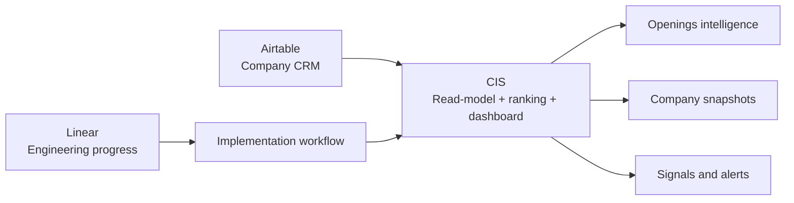
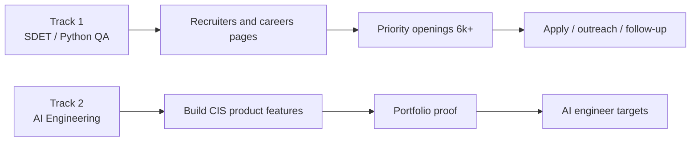
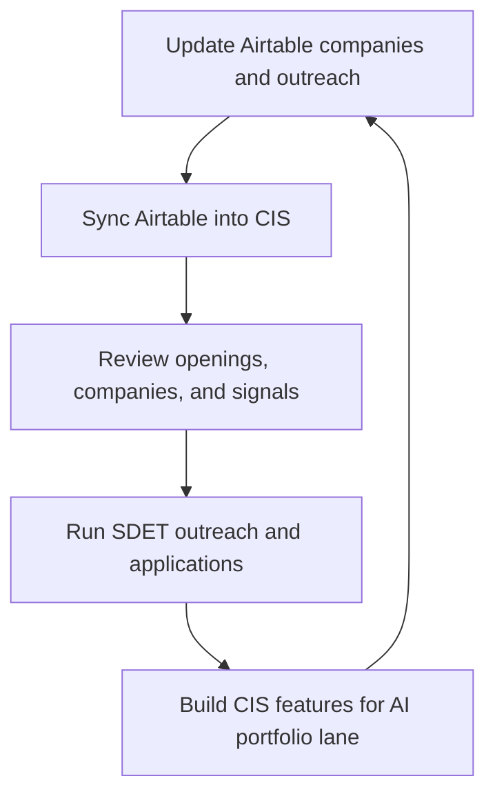

# Career Intelligence System

Career Intelligence System is a local-first career operating system with two parallel tracks:

- `SDET / Python QA Automation`
  - short horizon
  - goal: land one `6k+` role and consolidate into one project
- `AI Engineering / Python AI`
  - medium horizon
  - goal: use CIS itself as the portfolio case for an eventual switch

## Operating Model

- `Airtable`
  - editable source of truth for company search and outreach
- `Linear`
  - engineering delivery and implementation progress
- `CIS`
  - read-model, ranking engine, dashboard, and intelligence layer

## Where To Look For What

| Tool | Use it for | Do not use it for |
| --- | --- | --- |
| `Airtable` | Companies, careers pages, recruiters, contacts, outreach | Engineering backlog |
| `Linear` | Epics, implementation tasks, milestones, bugs, releases | Company universe or outreach CRM |
| `CIS` | Jobs, company intelligence, strategy, signals, alerts | Editing core CRM records in v1 |

## System Responsibility Map



## Dual-Track Flow



## Weekly Work Loop



## Current Architecture

- Backend: Python 3.12, `uv`, FastAPI, SQLAlchemy async, Alembic, APScheduler
- Frontend: Next.js 15, TypeScript, Tailwind CSS v4, TanStack Query v5, Recharts, `shadcn/ui` primitives
- Database: PostgreSQL 17 with `pgvector`
- Infra: Docker Compose, Caddy

## Sources

- Local scrapers:
  - DOU
  - Djinni
  - BigCo
  - Hacker News
- Hosted scraper:
  - LinkedIn via Apify
- Source notes:
  - `SCRAPERS.md`

## Alerts

- Slack:
  - new active jobs can be posted to Slack via Incoming Webhook
  - scheduler polls unposted jobs and marks them after delivery
  - manual trigger:

```bash
curl -X POST http://localhost:8000/api/alerts/slack/send
```

## Agent Bridge

Optional separate utility:
- `Claude Code` acts as planner
- `Codex` acts as executor
- Slack thread is the shared coordination surface
- supports `orchestrator` mode and `codex-follower` mode

Runner:

```bash
cd backend
uv run python scripts/slack_agent_bridge.py
```

Required env for the bridge:

```env
SLACK_BOT_TOKEN=xoxb-...
SLACK_APP_TOKEN=xapp-...
PLANNER_COMMAND=claude -p --permission-mode bypassPermissions --model sonnet
EXECUTOR_COMMAND=codex exec --dangerously-bypass-approvals-and-sandbox --cd {cwd} -o {output_file}
```

## Airtable Setup

1. Create a new Airtable base for CIS.
2. Create the `Companies` table first.
3. Import the starter template from `ops/airtable/companies_template.csv`.
4. Add a local backend env file:

```bash
cp backend/.env.example backend/.env
```

5. Set:

```env
AIRTABLE_PAT=...
AIRTABLE_BASE_ID=app...
AIRTABLE_TABLE_COMPANIES=Companies
AIRTABLE_SYNC_INTERVAL_MINUTES=60
SLACK_WEBHOOK_URL=https://hooks.slack.com/services/...
SLACK_POST_INTERVAL_MINUTES=15
SLACK_MIN_MATCH_SCORE=0
SLACK_MAX_POSTS_PER_RUN=10
```

6. Run manual sync:

```bash
curl -X POST http://localhost:8000/api/sync/airtable
```

If `AIRTABLE_BASE_ID` is missing or the token has no accessible bases, the sync endpoint returns `503`.
If `SLACK_WEBHOOK_URL` is missing, Slack dispatch is skipped by the scheduler and the manual endpoint returns `503`.

## Linear Setup

`Linear` is not wired into runtime code in v1 by design.

Use one project:
- `CIS v2`

Use these epics:
- `Foundation`
- `Airtable Sync`
- `Companies UI`
- `Signals & Reddit`
- `Telegram & Actions`

Backlog blueprint:
- `ops/linear/cis_v2_backlog.md`

## Docs

- Operating model and execution rules:
  - `PLAYBOOK.md`
- Slack collaboration protocol for Claude + Codex:
  - `SLACK_COLLABORATION.md`
- Scraper notes:
  - `SCRAPERS.md`
- Airtable starter import:
  - `ops/airtable/companies_template.csv`
- Linear backlog blueprint:
  - `ops/linear/cis_v2_backlog.md`

## Local Backend Workflow

```bash
cd backend
uv sync --dev
uv run alembic upgrade head
uv run uvicorn main:app --reload
```

## Local Frontend Workflow

```bash
cd frontend
npm install
npm run dev
```

## Verification

```bash
cd backend && uv run ruff check . && uv run pytest
cd frontend && npm run build
```

## Docker

```bash
docker compose up -d
curl http://localhost:8000/health
```

Expected health response:

```json
{"status":"ok","db":"connected"}
```
